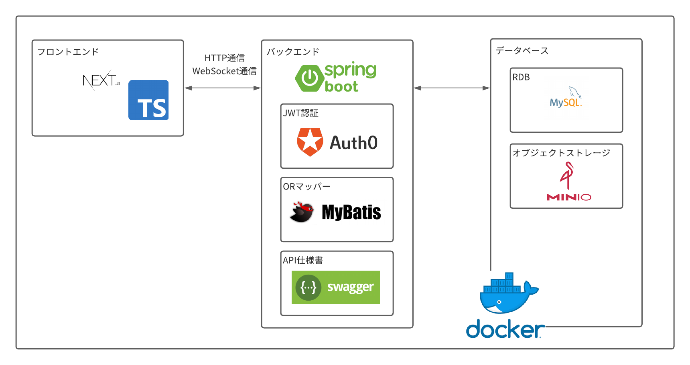

<p>
    <a href="https://twitter.com/alichan0609"></a>
    <a href="https://github.com/alichan-69/hostnavi-admin-frontend"></a>
    <a href="https://github.com/alichan-69/hostnavi-admin-backend"></a>
    <a href="https://github.com/alichan-69/hostnavi-admin-infra"></a>
    <a href="https://github.com/alichan-69/hostnavi"></a>
</p>

# HostNavi


`HostNavi`は、SpringBoot2.7、MyBatis、JWT 認証、WebSocket、Swagger UI、MinIO、Next、Typescript、Docker 等を用いた空き家の貸し出し管理システムのサンプルアプリケーションです。<br>
基本的な web アプリケーションを Next や SpringBoot、Docker 周辺の様々な技術を使用しつつ組み、その技術や開発方法を紹介するという目的のもと開発されています。

# 機能一覧


`HostNavi`には、空き家の登録、更新、削除、閲覧機能・カレンダーでの予約確認機能・予約者とのリアルタイムでのチャット機能・チャートでの実績閲覧機能等が実装されています。

# システム構成図



# ディレクトリ構成

```lua
├── hostnavi-admin-frontend --HostNaviのフロントエンドの開発リポジトリ(使用技術・開発方法説明README付き)
├── hostnavi-admin-backend --HostNaviのバックエンドの開発リポジトリ(使用技術・開発方法説明README付き)
├── hostnavi-admin-infra --HostNaviのインフラ環境構築のためのリポジトリ
└── README.md --HostNaviの説明用README
```

# 詳細なドキュメント

使用技術・開発方法の詳細が記載されたドキュメントを別ページで閲覧することができます。

- [HostNavi フロントエンド](https://github.com/alichan-69/hostnavi-admin-frontend/README.md)
- [HostNavi バックエンド](https://github.com/alichan-69/hostnavi-admin-backend/README.md)

# 採用技術一覧

メインで使用している技術の一覧を列挙しています。

## フロントエンド

| 技術            | 説明                                                    | 公式ドキュメント                             |
| --------------- | ------------------------------------------------------- | -------------------------------------------- |
| TypeScript4.4   | フロントエンド言語                                      | https://www.typescriptlang.org/              |
| Nextjs12        | フロントエンドフレームワーク                            | https://nextjs.org/                          |
| React Hook Form | フォームバリデーション実装用ライブラリ                  | https://www.react-hook-form.com/             |
| yup             | バリデーションスキーマ定義用のライブラリ                | https://github.com/jquense/yup#schema-basics |
| Material UI5.0  | React 用 UI ライブラリ                                  | https://mui.com/                             |
| STOMP.js        | WebSocket 通信を STOMP プロトコルで行うためのライブラリ | https://github.com/stomp-js/stompjs          |
| SockJS-client   | WebSocket 通信用のクライアントライブラリ                | https://github.com/sockjs/sockjs-client      |
| axios           | HTTP 通信用のクライアントライブラリ                     | https://github.com/axios/axios               |
| Tailwindcss     | CSS フレームワーク                                      | https://tailwindcss.com/                     |
| Eslint          | TypeScript 用リンター                                   | https://eslint.org/                          |
| Husky           | Git フック設定様ライブラリ                              | https://github.com/typicode/husky            |
| Prettier        | コードフォーマッター                                    | https://prettier.io/                         |
| Sass            | 効率的に CSS を記載できるライブラリ                     | https://sass-lang.com/                       |
| Stylelint       | CSS 用のリンター                                        | https://stylelint.io/                        |

## バックエンド

| 技術                          | 説明                                           | 公式ドキュメント                                                |
| ----------------------------- | ---------------------------------------------- | --------------------------------------------------------------- |
| Java17                        | バックエンド言語                               | https://docs.oracle.com/javase/jp/17/docs/api/index.html        |
| SpringBoot2.7                 | バックエンドフレームワーク                     | https://docs.spring.io/spring-boot/docs/2.7.8/reference/html    |
| SpringSecurity5.7             | 認証ライブラリ                                 | https://docs.spring.io/spring-security/reference/5.7/index.html |
| Java-JWT4.3                   | JWT 認証用ライブラリ                           | https://github.com/jwtk/jjwt                                    |
| MyBatis3.0                    | OR マッパー                                    | https://mybatis.org/mybatis-3/                                  |
| PageHelper                    | MyBatis 用ページヘルパー実装用ライブラリ       | https://github.com/pagehelper/Mybatis-PageHelper                |
| MyBatisGenerator              | MyBatis 用モデル・マッパー自動生成用ライブラリ | https://mybatis.org/generator/                                  |
| ModelMapper                   | オブジェクト詰め替えようライブラリ             | http://modelmapper.org/                                         |
| spring-boot-starter-websocket | SpringBoot での WebSocket 通信用ライブラリ     | https://spring.pleiades.io/guides/gs/messaging-stomp-websocket/ |
| Lombok                        | ボイラープレート省略用ライブラリ               | https://projectlombok.org/features/                             |
| Springfox                     | API 仕様書自動生成用ライブラリ                 | https://github.com/springfox/springfox                          |
| DBUnit                        | CSV でのデータベーステスト支援ライブラリ       | https://dbunit.sourceforge.net/dbunit/index.html                |

## インフラ

| 技術     | 説明                       | 公式ドキュメント          |
| -------- | -------------------------- | ------------------------- |
| Docker   | コンテナ管理ソフトウェア   | https://www.docker.com/   |
| MySQL8.0 | リレーショナルデータベース | https://www.mysql.com/jp/ |
| MinIO    | オブジェクトストレージ     | https://min.io/           |

# 開発環境の構築方法

## フロントエンド

1. プロジェクトの clone<br>
   プロジェクトを作成したいディレクトリ配下で以下コマンドを実行。
   プロジェクト作成後は、プロジェクトディレクトリ配下で以下コマンドを実行を実行するため、プロジェクトディレクトリに移動。

```bash
$ git clone https://github.com/alichan-69/hoostnavi-admin-frontend.git
$ cd hostnavi-admin-frontend
```

2. 指定バージョンの nodejs のインストール<br>
   `hostnavi-admin-frontend`で使用されているバージョンの nodejs をインストールする。<br>
   `nvm`でインストールするため、インストールされていない場合、一行目も実行

```bash
$ brew install nvm
$ nvm install
$ nvm use
```

3. yarn のインストール<br>
   指定バージョンの nodejs に付属する npm に依存した yarn をインストールしたいため、以下コマンドを実行

```bash
$ npm install yarn
```

4. プロジェクトで使用するライブラリのインストール
   以下コマンドを実行

```bash
$ yarn install
```

5. ローカルサーバーの立ち上げ
   以下コマンドを実行

```bash
$ yarn dev
```

## バックエンド

以下の環境構築は全て Pleiades を導入した Eclipse 内で行う。<br>
インストールがまだの場合、1 も実行。

1. [公式サイト](https://mergedoc.osdn.jp/)で`Pleiades All in One Eclipse`をインストール。
2. プロジェクトの clone<br>
   Eclipse のメニューからファイル > インポート > Git からプロジェクト > クローン URI を選択。<br>
   URI に`https://github.com/alichan-69/hostnavi-admin.git`を入力、クローン。
3. `hostnavi-admin`を Maven プロジェクトとして認識させる。<br>
   `hostnavi-admin`を右クリックして、構成 > Maven プロジェクトへ変換 を選択。
4. Maybatis Generator でモデルとマッパーを生成する<br>
   `hostnavi-admin`を右クリックして、実行 > Spring Boot アプリケーション > Generator > OK をクリックする。<br>
5. SpringBootApplication を起動する<br>
   `hostnavi-admin`を右クリックして、実行 > Spring Boot アプリケーション > HostNaviAdminApplication > OK をクリックする。<br>

## データベース

以下の環境構築は全て Docker を使用して行う。

1. Docker のインストール<br>
   [Docker docs](https://matsuand.github.io/docs.docker.jp.onthefly/get-docker/)から Docker Desktop をインストール

2. コンテナの起動<br>
   `hostnavi-docker`配下で、以下コマンドを実行して、コンテナを立ち上げる。

   ```
   $ docker-compose up -d
   ```

3. MySQL のデータ初期化<br>
   `hostnavi-docker`配下で、以下コマンドを実行して、MySQL のデータを初期化する。
   ```
   $ ./init-mysql.sh
   ```

# ライセンス

[MIT Licence](./LICENCE)
